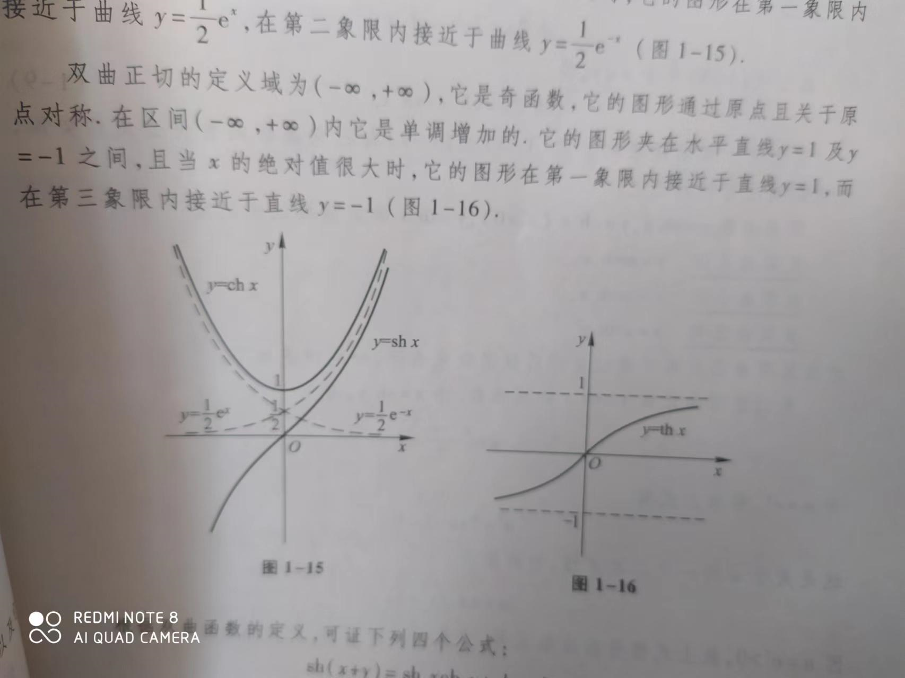
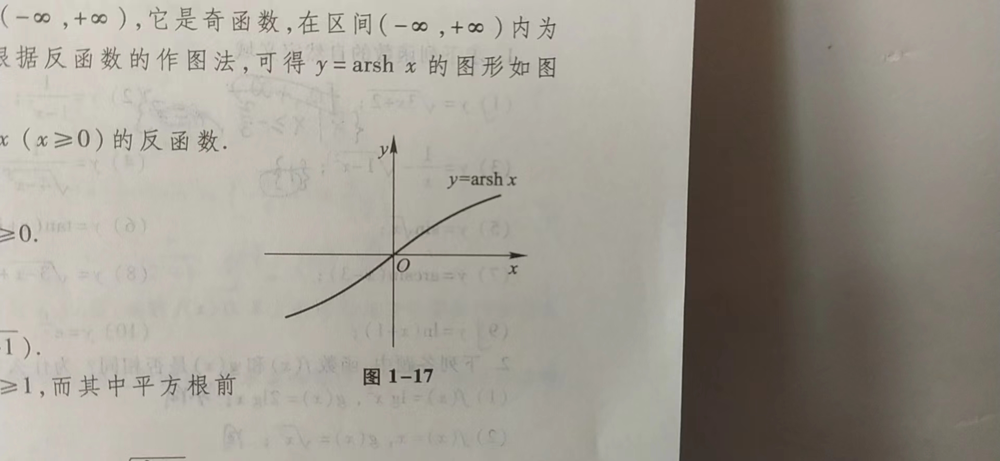
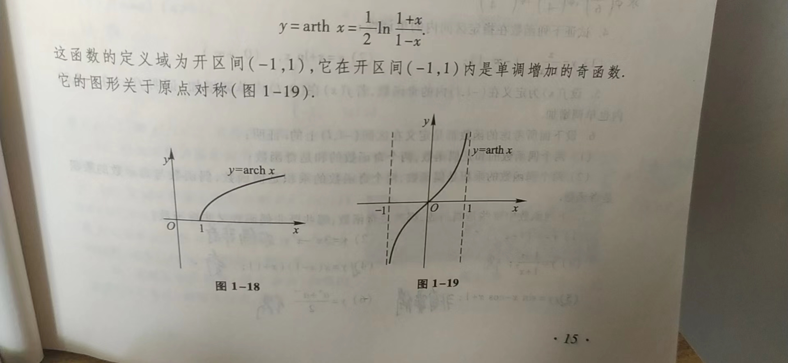
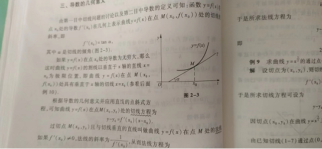
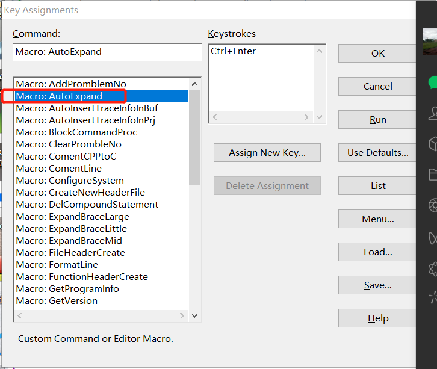

# 1.工具使用篇

## 1.1typora使用教程

### 1.1.1快速开始

#### 1.1.1.1打开面板

打开面板使用快捷键Ctrl+P或者单击菜单栏文件>“快速打开”，在面板中可以查找当前文件夹中的文件

#### 1.1.1.2导入导出

typora可以将文件导出为PDF, HTML等文件格式。单击菜单栏>文件>导出>...

### 1.1.2使用手册

#### 1.1.2.1标题

创建标题使用#+空格+内容，连续1~6个#号代表1~6级标题，或者直接使用快捷键Ctrl+1~6

#### 1.1.2.2引用文字

Markdown使用>字符生成块

#### 1.1.2.3列表

输入*或者+或者-然后+空格可以生成一个无序列表，输入1.+空格可以生成一个有序列表

#### 1.1.2.4任务列表

输入- [ ]+空格可以生成一个带复选框的任务列表

#### 1.1.2.5代码块

输入```+回车可以生成一个代码块，可以编写代码

#### 1.1.2.6数学公式块

输入$$+回车可以生成一个Tex/LaTex源代码的输入区域，用来编写数学公式

#### 1.1.2.7表格

输入| First Header | Second Header |+回车可以生成一个包含2列的表格

#### 1.1.2.8水平线

输入***或者---+回车可以生成一条水平线

#### 1.1.2.9目录(TOC)

输入[toc]+回车可以自动从文档中提取所有标题

#### 1.1.3.0连接

Markdown支持两种类型的链接：内联和引用，链接文本写在[]内。

要创建内联链接，请在链接文本的结束方括号后立即使用一组圆括号并在圆括号内放URL地址以及可选的用引号括起来的链接标题。

将圆括号内的href设置为文档内的标题，可以链接到文档内对应标题处

#### 1.1.3.1斜体、粗体

Ctrl+i设置字体为斜体，Ctrl+b设置字体为粗体

#### 1.1.3.2上标

要使用此功能，首先，请在 `偏好设置` 面板 -> `Markdown扩展语法` 选项卡中启用它。然后用 `^` 来包裹上标内容，例如： `X^2^`。

#### 1.1.3.3下标

要使用此功能，首先，请在 `偏好设置` 面板 -> `Markdown扩展语法` 选项卡中启用它。然后用 `^` 来包裹上标内容，例如： `X^2^`。

#### 1.1.3.4高亮

要使用此功能，首先，请在 `偏好设置` 面板 -> `Markdown扩展语法` 选项卡中启用它。然后用 `==` 来包裹高亮内容，例如： `==highlight==`。

#### 1.1.3.5HTML

您可以使用HTML来设置纯 Markdown 不支持的内容，例如， `<span style="color:red">this text is red</span>` 用于添加红色文本。

#### 1.1.3.6视频

您可以使用 `<video>` HTML标记嵌入视频，例如：

```Markdown
<video src="xxx.mp4" />
```

## 1.2latex学习笔记

### 1.2.1Latex字体设置

正常字体：\mathnormal{A}--->A

罗马字体：\mathrm{A}--->A

斜体：\mathit{A}--->A

黑粗体：\mathbf{A}--->A

黑板体(空心体)：\mathbb{A}--->A

书法艺术体：\mathcal{A}--->A

书写体：\mathscr{A}--->A

更多字体可以参考 [链接](https://blog.csdn.net/wzz110011/article/details/124753129 "Latex字体设置")

### 1.2.2Latex常用符号

#### 1.2.2.1操作符

| Symbol       | Command          | Symbol | Command | Symbol | Command |
| ------------ | ---------------- | ------ | ------- | ------ | ------- |
| ±            | \pm              | ∓      | \mp     | ×      | \times  |
| ÷            | \div             |        |         |        |         |
| ⋆            | \star            |        |         |        |         |
| ⨿            | \amalg           |        |         |        |         |
| ⊎            | \uplus           |        |         |        |         |
| ∨            | \vee             |        |         |        |         |
| ⊖            | \ominus          |        |         |        |         |
| ∙            | \bullet          |        |         |        |         |
| ⊳            | \rhd             |        |         |        |         |
| ⊘            | \oslash          |        |         |        |         |
| ◃            | \triangleleft    |        |         |        |         |
| ▽            | \bigtriangledown |        |         |        |         |
| $\setminus $ | \setminus        |        |         |        |         |
| *x*∘         | x^{\circ}        |        |         |        |         |
| *a**x*       | a^x              |        |         |        |         |

更多符号参考[链接](https://blog.csdn.net/LCCFlccf/article/details/89643585)

# 2.高等数学

## 2.1映射

### 2.1.1映射概念

设X,Y是两个非空集合，如果存在一个法则f,使得X中每个元素x按法则f，在Y中有唯一确定得元素y与之对应，那么称f为从X到Y的映射。记作：
$$
f: \mathbf{X}\rightarrow\mathbf{Y},
$$
其中y称为元素x在映射f下的**像**，记作f(x),即：
$$
y = f(x),
$$
而元素x称为元素y在映射f下的一个**原像;**集合X称为f的**定义域**，记作:
$$
\mathbf{D}_f
$$
X中所有元素的像组成的集合称为f的**值域**，记作：
$$
\mathbf{R}_f 或者f(X)
$$
即：
$$
\mathbf{R}_f = f(X) = \begin{vmatrix}
f(x)\mid x \in \mathbf{X}
\end{vmatrix},
$$

### 2.1.2函数单调性

设函数f(x)的定义域为D,区间
$$
\mathbf{I} \subset \mathbf{D}
$$
如果对于区间I上的任意两点x1及x2，当x1<x2时，恒有
$$
f(x_1) < f(x_2),
$$
那么称f(x)在区间I上单调递增。

如果对于区间I上的任意两点x1及x2，当x1>x2时，恒有
$$
f(x_1) < f(x_2),
$$
那么称f(x)在区间I上单调递减。

### 2.1.3函数奇偶性

设函数f(x)的定义域D关于原点对称，如果对任一
$$
x \in D, f(-x) = f(x)
$$
称函数为偶函数。

如果对任一
$$
x \in D, f(-x) = -f(x)
$$
称函数为奇函数。

偶函数图形关于y轴对称，奇函数图形关于原点对称。

### 2.1.4函数周期性

设函数f(x)的定义域为D，如果存在一个正数l，使得任一
$$
x \in D 有 (x+l) \in D，且 f(x+l) = f(x)
$$
恒成立，称f(x)为周期函数，l称为f(x)的周期。

### 2.1.5初等函数

1.幂函数：
$$
y=x^\mu,(\mu \in R是常数)
$$
2.指数函数：
$$
y = a^x,(a > 0 且 a \neq 1)
$$
3.对数函数：
$$
y = log_ax, (a > 0 且 a \neq 1, 特别当 a=e时,记为y=lnx)
$$
4.三角函数：
$$
y=sinx,\\
y=cosx,\\
y=tanx,等
$$
5.反三角函数：
$$
y=arcsinx,\\
y=arccosx,\\
y=arctanx，等
$$
以上5类函数统称为基本初等函数。

### 2.1.6双曲函数

1.双曲正弦：
$$
shx = \frac{e^x - e ^{-x}}{2},(x \in (-\infty, +\infty))
$$
2.双曲余弦：
$$
chx = \frac{e^x + e^{-x}}{2}, (x \in (-\infty, +\infty))
$$
3.双曲正切：
$$
thx = \frac{shx}{chx}=\frac{e^x - e^{-x}}{e^x + e^{-x}},(x \in (-\infty, +\infty))
$$
双曲图形如下图所示：


$$
shx是奇函数，通过原点并关于原点对称，在定义域内单调递增，当x趋于正无穷大\\时,shx靠近y=\frac{1}{2}e^x,当x趋于负无穷大时shx靠近y=-\frac{1}{2}e^{-x}。\\chx是偶函数，通过点(0,1)关于y轴对称，当x趋于正无穷大时chx靠近y=\frac{1}{2}e^x\\,当x趋于负无穷大时,chx靠近y=\frac{1}{2}e^{-x}。\\
thx是奇函数，通过原点并关于原点对称，在定义域内单调递增，当x趋于正无穷大\\时,thx靠近y=1,当x趋于负无穷大时,thx靠近y=-1
$$
双曲线4个公式：
$$
sh(x+y) = shxchy+chxshy,\\
sh(x-y) = shxchy-chxshy,\\
ch(x+y) = chxchy+shxshy,\\
ch(x-y) = chxchy-shxshy,
$$
反双曲与反三角函数类似：

反双曲正弦：
$$
y=arshx=ln(x+\sqrt{x^2 + 1}), (x \in (-\infty, +\infty))
$$
反双曲正弦图形：



反双曲余弦：
$$
y = archx = ln(x+\sqrt{x^2-1}), (x \in [1, +\infty))
$$
反双曲正切：
$$
y=arthx = \frac{1}{2}ln\frac{1+x}{1-x}, (x \in (-1, 1))
$$
反双曲余弦，反双曲正切函数图形：



### 2.1.7数列极限

定义：设 \{Xn\}为一数列，如果存在常数a，对于任意给定的正数
$$
\varepsilon
$$
(不论它多么小)，总存在正整数N，使得n>N时，不等式
$$
\mid x_n - a \mid < \varepsilon
$$
都成立，那么就称常数a是数列\{x_n\}的极限，或者称数列收敛于a，记为
lim Xn = a,

### 2.1.8夹逼准则

数列{Xn},{yn},{Zn}满足下列条件：

(1)从某项起,当n > n0时，有
$$
y_n \le x_n \le z_n;
$$
(2)
$$
limy_n = a, limz_n = a, n\rightarrow\infty
$$
那么：
$$
limx_n = a，n\rightarrow\infty
$$
两个重要极限：
$$
lim sinx/x = 0, x\rightarrow\infty,\\
lim(1+1/x)^x = e, x\rightarrow\infty,\\
lim sinx/x = 1, x\rightarrow0,
$$

### 2.1.9导数

#### 2.1.9.1导数定义

设函数y=f(x)在点x0的某个邻域内有定义，当x在x0处取得增量△x(x0+△X扔在该邻域内)时，△y=f(x0+△x)-f(x0)，如果△y域△x之比当△x→0时极限存在，那么称函数y=f(x)在点x0处可导，并称这个极限为函数y=f(x)在点x0处的导数，记为：
$$
f'(x0) = \frac{dy}{dx}\mid x=x0,\\
函数在点x_0可导的充分必要条件是点x_0的左导数f'_-(x_0)与右导数f'_+(x_0)都存在，且f'_-(x_0)=f'_+(x_0)
$$

#### 2.1.9.2常规函数导数

$$
f(x)=C,(C是常数)，f'(x) = 0,\\
f(x)=x^n,(n \in N_+), f'(x)=nx^{n-1},\\
f(x)=sinx, f'(x)=cosx,\\
f(x)=cosx, f'(x)=-sinx,\\
f(x)=a^x,(a>0且a\neq1),f'(x)=a^xlna,当a=e时，f'(x)=e^x,\\
f(x)=log_ax,(a>0且a\neq1),f'(x)=\frac{1}{xlna},当a=e时,f'(x)=\frac{1}{x},
$$

#### 2.1.9.3导数的几何意义



导数表现为在曲线y=f(x)上任意点M(x0, y0)的切线斜率，过点M并与切线MT垂直的直线称为M点的法线
$$
法线的斜率为：-\frac{1}{f'(x0)},
法线方程为：y-y0 = -\frac{1}{f'(x_0)}(x-x_0).
$$
**如果切线水平或者垂直，那么函数不可导**

#### 2.1.9.4函数求导法则

1.常数和基本初等函数的导数公式：
$$
(1) (C)' = 0,\quad(2)(x^\mu)'=\mu x^{\mu-1},\\
(3)(sinx)'=cosx,\quad (4)(cosx)'=-sinx,\\
(5)(tanx)'=sec^2x,\quad (6)(cotx)'=-csc^2x,\\
(7)(secx)'=secxtanx,\quad (8)(cscx)'=-scsxcotx,\\
(9)(a^x)'=a^xlna\quad (a>0, a \neq 1),\quad (10)(e^x)'=e^x,\\
(11)(log_ax)'=\frac{1}{xlna}\quad (a>0,a \neq 1),\quad (12)(lnx)'=\frac{1}{x},\\
(13)(arcsinx)'=\frac{1}{\sqrt{1-x^2}},\quad (14)(arccosx)'=-\frac{1}{\sqrt{1-x^2}},\\
(15)(arctanx)'=\frac{1}{1+x^2},\quad (16)(arccotx)'=-\frac{1}{1+x^2}.
$$
2.函数的和，差，积，商的求导法则
$$
(1)(u \pm v)'=u'\pm v', \quad (2)(Cu)'=Cu'\quad(C是常数).\\
(3)(uv)'=u'v+uv',\quad (4)(\frac{u}{v})'=\frac{u'v - uv'}{v^2}\quad (v \neq 0).
$$

3.反函数求导法则
$$
设x=f(y)在区间I_y内单调，可导且f'(y) \neq 0,则它的反函数y=f^{-1}(x)在I_x=f(I_y)内也可导，且\\
[f^{-1}(x)]'=\frac{1}{f'(y)}\quad 或 \quad \frac{dy}{dx}=\frac{1}{\frac{dx}{dy}}
$$
4.复合函数求导法则
$$
设y=f(u),而u=g(x)且f(u)及g(x)都可导，则复合函数y=f[g(x)]的导数为\\
\frac{dy}{dx}=\frac{dy}{du}\bullet\frac{du}{dx}\quad 或 \quad y'(x)=f'(u)\bullet g'(x).
$$

#### 2.1.9.5高阶导数

变速直线运动的速度v(t)是位置函数s(t)对时间t的导数，即
$$
v=\frac{ds}{dt}\quad 或 \quad v=s'
$$
加速度是速度v对时间t的导数，即
$$
a=\frac{dv}{dt}=\frac{d}{dt}(\frac{ds}{dt})\quad 或 \quad a=(s')'
$$
速度v是s对t的二阶导数，记作
$$
y''=(y')' \quad 或 \quad \frac{d^2y}{dx^2}=\frac{d}{dx}(\frac{dy}{dx})
$$
二阶以及二阶以上的导数称为高阶导数。

#### 2.1.9.6隐函数求导

定义：一般地，如果变量x和y满足一个方程F(x, y) = 0，在一定条件下，当x取某区间内的任一值时，相应地总有满足这方程的唯一的y值存在，那么就说方程F(x, y)=0在该区间内确定了一个隐函数。
$$
例1，求方程e^y+xy-e=0所确定的隐函数的导数\frac{dy}{dx}.\\
解：\\
方程左边对x求导得\quad \frac{d}{dx}(e^y+xy-e)=e^y\frac{dy}{dx}+y+x\frac{dy}{dx},\\
方程右边对x求导得\quad (0)'=0,\\
方程两边对x求导相等，所以\\
e^y\frac{dy}{dx}+y+x\frac{dy}{dx}=0,\\
从而\\
\frac{dy}{dx}=-\frac{y}{x+e^y}
$$

#### 2.1.9.7微分定义

假设一金属片边长为x0,由于受热变成x0+△x，那么金属片面积变化量是△y=(x0+△x)² - x0² = 2x0△x+△x²。由于△x²是比△x高阶的无穷小，所以当△x很小时，面积变化可由2x0△x代替。

设函数y=f(x)在某区间内有定义，x0及x0+△x在这区间内，如果函数的增量△y=f(x0+△x)-f(x0)，可表示为△y=A△x+o(△x).其中A是不依赖△x的常数，那么称函数y=f(x)在点x0是可微的，而A△x叫做函数y=f(x)在点x0相应于自变量增量△x的微分，记作dy，即dy=A△x。

# 3.STM32F429学习笔记

## 3.1Doxygen注释规范

doxygen是解析源文件和生成文档的主要程序。详细使用方法可以参见[Doxygen usage](https://link.zhihu.com/?target=http%3A//doxygen.nl/manual/doxygen_usage.html) 。原文：[http://doxygen.nl/manual](https://link.zhihu.com/?target=http%3A//doxygen.nl/manual)

### 3.1.1注释块描述方法

1.使用带两个*开头的javadoc风格

```java
/**
 * ... text ...
 */
```

2.使用*!开头的Qt风格

```c++
/*!
 * ... text ...
 */
```

3.至少用两行C++注释开始，每行以额外的/或!开头并且注释末尾是一个空行

```C++
///
/// ... text ...
///
```

or

```C++
//!
//!... text ...
//!
```

4.如果要使注释块在文档中更明显，可以使用一下方法

```C++
/********************************************//**
 *  ... text
 ***********************************************/
```

or

```C++
/////////////////////////////////////////////////
/// ... text ...
/////////////////////////////////////////////////
```

or

```C++
/************************************************
 *  ... text
 ***********************************************/
```

以上是注释块详细描述方法，以下是注释块简短描述方法

5.使用\brief命令，该命令以段落结束，所以详细描述以一个空行开始，例如：

```C++
/*! \brief Brief description.
 *         Brief description continued.
 *
 *  Detailed description starts here.
 */
```

6.如果配置文件里的JAVADOC_AUTOBRIEF被设置成YES，这会使用javadoc风格注释块自动开始一个brief并且以空格或新行后的第一个点结束，例如：

```java
/** Brief description which ends at this dot. Details follow
 *  here.
 */
```

```C++
/// Brief description which ends at this dot. Details follow
/// here.
```

7.使用C++风格，注释不超过1行

```C++
/// Brief description.
/** Detailed description. */
```

or

```c++
//! Brief description.

//! Detailed description
//! starts here.
```

8.将注释放在变量之后需要添加一个<标记，例如

```java
int var; /*!< Detailed description after the member */
```

or

```c++
int var; /**< Detailed description after the member */
```

or

```c++
int var; //!< Detailed description after the member
         //!<
```

or

```c++
int var; ///< Detailed description after the member
         ///<
```

对于函数用@param命令来标记参数，使用[in],[out],[in, out]来标记参数方向

```c
void foo(int v /**< [in] docs for input parameter v. */);
```

使用注释块例子：

```java
/*! A test class */

 

class Afterdoc_Test

{

  public:

    /** An enum type. 

     \*  The documentation block cannot be put after the enum! 

     */

    enum EnumType

    {

      int EVal1,     /**< enum value 1 */

      int EVal2      /**< enum value 2 */

    };

    void member();   //!< a member function.

    

  protected:

    int value;       /*!< an integer value */

};
```

Qt风格注释块

```c++
//!  A test class. 

/*!

  A more elaborate class description.

*/

 

class QTstyle_Test

{

  public:

 

    //! An enum.

    /*! More detailed enum description. */

    enum TEnum { 

                 TVal1, /*!< Enum value TVal1. */  

                 TVal2, /*!< Enum value TVal2. */  

                 TVal3  /*!< Enum value TVal3. */  

               } 

         //! Enum pointer.

         /*! Details. */

         *enumPtr, 

         //! Enum variable.

         /*! Details. */

         enumVar;  

    

    //! A constructor.

    /*!

      A more elaborate description of the constructor.

    */

    QTstyle_Test();

 

    //! A destructor.

    /*!

      A more elaborate description of the destructor.

    */

   ~QTstyle_Test();

    

    //! A normal member taking two arguments and returning an integer value.

    /*!

      \param a an integer argument.

      \param s a constant character pointer.

      \return The test results

      \sa QTstyle_Test(), ~QTstyle_Test(), testMeToo() and publicVar()

    */

    int testMe(int a,const char *s);

       

    //! A pure virtual member.

    /*!

      \sa testMe()

      \param c1 the first argument.

      \param c2 the second argument.

    */

    virtual void testMeToo(char c1,char c2) = 0;

   

    //! A public variable.

    /*!

      Details.

    */

    int publicVar;

       

    //! A function variable.

    /*!

      Details.

    */

    int (*handler)(int a,int b);

};
```

JAVA风格注释块

```c++
/**

 \*  A test class. A more elaborate class description.

 */

 

class Javadoc_Test

{

  public:

 

    /** 

     \* An enum.

     \* More detailed enum description.

     */

 

    enum TEnum { 

          TVal1, /**< enum value TVal1. */  

          TVal2, /**< enum value TVal2. */  

          TVal3  /**< enum value TVal3. */  

         } 

       *enumPtr, /**< enum pointer. Details. */

       enumVar;  /**< enum variable. Details. */

       

      /**

       \* A constructor.

       \* A more elaborate description of the constructor.

       */

      Javadoc_Test();

 

      /**

       \* A destructor.

       \* A more elaborate description of the destructor.

       */

     ~Javadoc_Test();

    

      /**

       \* a normal member taking two arguments and returning an integer value.

       \* @param a an integer argument.

       \* @param s a constant character pointer.

       \* @see Javadoc_Test()

       \* @see ~Javadoc_Test()

       \* @see testMeToo()

       \* @see publicVar()

       \* @return The test results

       */

       int testMe(int a,const char *s);

       

      /**

       \* A pure virtual member.

       \* @see testMe()

       \* @param c1 the first argument.

       \* @param c2 the second argument.

       */

       virtual void testMeToo(char c1,char c2) = 0;

   

      /** 

       \* a public variable.

       \* Details.

       */

       int publicVar;

       

      /**

       \* a function variable.

       \* Details.

       */

       int (*handler)(int a,int b);

};
```

文档结构命令

\struct 用来代表一个结构体类型

\union 用来代表一个联合体类型

\enum 用来代表一个枚举类型

\fn 用来代表一个函数

\var 用来代表一个变量类型或枚举的值

\def 用来代表一个宏

\typedef 用来代表一个typedef类型

\file 用来代表一个文件

\namespace 用来代表一个命令空间

\package 用来代表一个包

\interface 用来代表一个接口

更过其它结构命令请参考 [Special Commands](https://doxygen.nl/manual/commands.html) 

对于全局对象，你必须记住它们定义的文件

```c
/*! \file */ 
```

or

```c
/** @file */
```

例如：

```C++
/*! \file structcmd.h

    \brief A Documented file.

    

    Details.

*/

 

/*! \def MAX(a,b)

    \brief A macro that returns the maximum of \a a and \a b.

   

    Details.

*/

 

/*! \var typedef unsigned int UINT32

    \brief A type definition for a .

    

    Details.

*/

 

/*! \var int errno

    \brief Contains the last error code.

 

    \warning Not thread safe!

*/

 

/*! \fn int open(const char *pathname,int flags)

    \brief Opens a file descriptor.

 

    \param pathname The name of the descriptor.

    \param flags Opening flags.

*/

 

/*! \fn int close(int fd)

    \brief Closes the file descriptor \a fd.

    \param fd The descriptor to close.

*/

 

/*! \fn size_t write(int fd,const char *buf, size_t count)

    \brief Writes \a count bytes from \a buf to the filedescriptor \a fd.

    \param fd The descriptor to write to.

    \param buf The data buffer to write.

    \param count The number of bytes to write.

*/

 

/*! \fn int read(int fd,char *buf,size_t count)

    \brief Read bytes from a file descriptor.

    \param fd The descriptor to read from.

    \param buf The buffer to read into.

    \param count The number of bytes to read.

*/

 

\#define MAX(a,b) (((a)>(b))?(a):(b))

typedef unsigned int UINT32;

int errno;

int open(const char *,int);

int close(int);

size_t write(int,const char *, size_t);

int read(int,char *,size_t);
```

使用\verbinclude可以阻止doxygen解析文档

```shell
/*! \file myscript.sh
 *  Look at this nice script:
 *  \verbinclude myscript.sh
 */
```

### 3.1.2python注释块

```python
"""@package docstring

Documentation for this module.

 

More details.

"""

 

def func():

    """Documentation for a function.

 

    More details.

    """

    pass

 

class PyClass:

    """Documentation for a class.

 

    More details.

    """

   

    def __init__(self):

        """The constructor."""

        self._memVar = 0;

   

    def PyMethod(self):

        """Documentation for a method."""

        pass
```

```python
## @package pyexample

\#  Documentation for this module.

\#

\#  More details.

 

\## Documentation for a function.

\#

\#  More details.

def func():

​    pass

 

\## Documentation for a class.

\#

\#  More details.

class PyClass:

   

    \## The constructor.

    def __init__(self):

        self._memVar = 0;

   

    \## Documentation for a method.

    \#  @param self The object pointer.

    def PyMethod(self):

        pass

     

    \## A class variable.

    classVar = 0;

 

    \## @var _memVar

    \#  a member variable
```

## 3.2Doxywizard工具使用说明

Doxywizard是一个帮助生成帮助文档的工具，具体使用可参看[中文教程](https://blog.csdn.net/qq_43331089/article/details/124489068)或者[官网教程](https://doxygen.nl/manual/doxywizard_usage.html)

## 3.3sourceinsight使用quicker.em

quicker.em是华为一个员工开发的sourceinsight宏，用来快速生成注释。

1.在GitHub搜[jaytang0923](https://github.com/jaytang0923)/**[sourceinsight_quicker.em](https://github.com/jaytang0923/sourceinsight_quicker.em)**下载

2.将它放入sourceinsight的base工程根目录下。

3.关闭base工程，打开自己的工程，选择菜单Options->Key Assignments，找到autoExpand设置快捷键，一般选择Ctrl+Enter



4.选择菜单Options->Menu Assignments，找到HeaderFileCreate，Menu选择Work后点击插入，这样就可以在菜单栏看到增加work，点击HeaderFileCreate可以自动添加头文件.

（1）、首先要把这个文件搞到手，然后将其加载到Base工程中，其次要定义一个快捷键调用quiker.em中的宏AutoExpand。quiker.em中写了那么多宏，为什么只调用AutoExpand宏就可以。因为调用AutoExpand宏后，AutoExpand会根据当前文本内容自动调用其他宏。一般情况下都用快捷键ctrl+enter调用AutoExpand宏。

（2）、输入文本config，然后执行AutoExpand，根据提示完成语言、姓名配置。

（3）、输入文本fu，然后执行AutoExpand，根据提示完成函数的注释。（在函数名的上一行执行）

（4）、输入文本if，然后执行AutoExpand，可以自动完成语法。其他类似。

（5）、输入文本file，然后执行AutoExpand，可以自动生成.c文件描述。

（6）、输入文本hdn，然后执行AutoExpand，根据提示完成.h文件宏定义。

（7）、在.c文件里输入hd，然后执行AutoExpand，可以自动生成.c文件对应的头文件。
————————————————
版权声明：本文为CSDN博主「程序员阿周」的原创文章，遵循CC 4.0 BY-SA版权协议，转载请附上原文出处链接及本声明。
原文链接：https://blog.csdn.net/qq_39660930/article/details/77499455

## 3.4sourceinsight宏

### 3.4.1宏函数声明

宏函数必须已macro或者function关键字开头，函数可以带参数，参数不用声明变量类型。

```C
macro HelloWorld()

{

  msg("Hello World!")  // message box appears with  "Hello World"

}
```

or

```c
function add2(n)

{

  return n + 2

}
```

### 3.4.2函数风格

宏函数有三种风格：

1.你可以使用快捷键或者菜单访问宏，但是这种宏一定要以macro关键字声明而且不能有参数

2.用来作为宏调用的函数必须以function关键字开头，例如：

```c
macro SaveCurrentFileNow()
{
	perform_save()
}
function perform_save()
{
	var hbuf
	hbuf = GetCurrentBuf()
	if (hbuf != nil)
		SaveBuf(hbuf)
}
```

3.用来连接到事件的函数必须以event关键字开头

# 4.git学习笔记

## 4.1git简介

git是一个代码管理工具，可以方便查看代码版本和团队合作开发项目。该章节学习内容参考[git手册](https://git-scm.com/)

## 4.2git安装和配置

### 4.2.1git安装

官方下载链接[Git - Downloads (git-scm.com)](https://git-scm.com/downloads)，打开后点击Download for Windows


点击64-bit Git for Windows Setup.下载


下载后双击运行安装就可以。

### 4.2.2git配置

1.git安装后首先要配置用户名和邮箱，右键鼠标运行Git Bash Here，执行命令：

```console
$ git config --global user.name "John Doe"
$ git config --global user.email johndoe@example.com
```

2.配置git默认文本编辑器，这里以Notepad++为例。[可选]

执行命令：

```console
$ git config --global core.editor "'C:/Program Files/Notepad++/notepad++.exe' -multiInst -notabbar -nosession -noPlugin"
```

3.检查配置，执行命令：

```console
$ git config --list
```

也可以通过输入 `git config <key>`： 来检查 Git 的某一项配置，例如：

```console
$ git config user.name
```

### 4.2.3git帮助命令

git可以通过以下3种方式获取git命令帮助说明：

```console
$ git help <verb>
$ git <verb> --help
$ man git-<verb>
```

例如想要获取git config命令帮助说明，可以输入

```console
$ git help config
```

如果不想要全面的手册，可以在后面加-h选项。

```console
$ git help config -h
```

## 4.3git基础

### 4.3.1创建git仓库

创建git仓库主要有两种方式。

1.在本地目录执行命令：

```console
$ git init
```

2.从远程库克隆代码：

```console
$ git clone 远程仓库链接
```

### 4.3.2在本地创建git仓库

选择一个文件夹输入`<span style="color:red">git init</span>创建仓库，这里将文件夹命名为learnGit，成功会出现一个.git文件夹，如果没有出现要点击查看->显示->隐藏项目就能看到了。


在learnGit根目录下新建文件readme.txt，然后输入命令 `<span style="color:red">git status</span>查看仓库文件状态。


此时文件名显示为红色，untracked表示文件未被git跟踪，可以输入命令`<span style="color:red">git add readme.txt</span>使该文件被git跟踪。此时再次运行<span style="color:red">git status</span>查看文件状态，发现文件名已变成绿色，说明该文件已被git跟踪


往readme.txt文件随便写入一些内容，再次运行<span style="color:red">git status</span>

发现文件名变成红色并且git提示该文件已被修改，可以使用命令

```console
git add readme.txt
```

将该文件放入暂存区，或者使用命令

```console
git restore readme.txt
```

放弃该文件的修改。

继续执行命令

```console
git add readme.txt
git status
```

文件名变成绿色，说明该文件已放入暂存区。


执行命令

```console
git commit -m "本次提交描述"
```

完成一次提交，再次执行

```console
git status
```

发现工作区已变干净，没有任何修改记录。


执行命令

```console
git log
```

可以查看提交记录


当然有时也可以通过git commit 后面加-a选项跳过git add步骤直接将被跟踪的文件一并提交。

```console
git commit -a readme.txt
```

### 4.3.3git删除文件或取消跟踪

#### 4.3.3.1git删除文件

git删除文件可以使用命令：

```console
git rm filename
```

如果该文件已经添加到暂存区或者已经修改过了需要加-f选项：

```console
git rm -f filename
```

如果希望只是取消git跟踪而保留文件的话需要加--cached选项：

```console
git rm --cached filename
```

删除命令可以使用glob模式，比如：

```console
git rm log/\*.log
```

该命令删除log目录下扩展名为.log的文件。

```console
git rm \*~
```

该命令会删除所有以~结尾的文件。

#### 4.3.3.2git重命名文件或移动文件

git重命名文件或移动文件使用命令：

```console
git mv filename_from filename_to
```

### 4.3.4git更改提交信息

要更改提交信息可以使用命令：

```console
git commit --amend
```

该命令会将暂存区中的文件提交，如果没有则只修改上一次的提交内容。

#### 4.3.4.1取消暂存文件

取消暂存文件使用命令：

```console
git reset HEAD filename
```

#### 4.3.4.2取消工作区文件内容修改

取消工作区文件内容修改可以使用命令：

```console
git restore filename
```

### 4.3.5git忽略文件

git忽略文件可以在和.git同一目录下新建文件.gitignore实现。但是.gitignore只能忽略未被git跟踪的文件，如果文件已被跟踪则需要使用git rm --cached filename取消git跟踪才行。

文件 .gitignore 的格式规范如下： 

• 所有空行或者以 # 开头的行都会被 Git 忽略。 

• 可以使用标准的 glob 模式匹配，它会递归地应用在整个工作区中。 • 匹配模式可以以（/）开头防止递归。 

• 匹配模式可以以（/）结尾指定目录。 

• 要忽略指定模式以外的文件或目录，可以在模式前加上叹号（!）取反。

所谓的 glob 模式是指 shell 所使用的简化了的正则表达式。 

星号（*）匹配零个或多个任意字符；

[abc] 匹配 任何一个列在方括号中的字符 （这个例子要么匹配一个 a，要么匹配一个 b，要么匹配一个 c）； 

问号（?）只 匹配一个任意字符；如果在方括号中使用短划线分隔两个字符， 表示所有在这两个字符范围内的都可以匹配 （比如 [0-9] 表示匹配所有 0 到 9 的数字）。 

使用两个星号（\**）表示匹配任意中间目录，比如 a/**/z 可以 匹配 a/z 、 a/b/z 或 a/b/c/z 等。

比如:

```console
# 忽略所有的 .a 文件
*.a
# 但跟踪所有的 lib.a，即便你在前面忽略了 .a 文件
!lib.a
# 只忽略当前目录下的 TODO 文件，而不忽略 subdir/TODO
/TODO
# 忽略任何目录下名为 build 的文件夹
build/
# 忽略 doc/notes.txt，但不忽略 doc/server/arch.txt
doc/*.txt
# 忽略 doc/ 目录及其所有子目录下的 .pdf 文件
doc/**/*.pdf
#忽略所有以.o或.a结尾的文件
*.[oa]
#忽略所有以~结尾的文件
*~
```

GitHub 有一个十分详细的针对数十种项目及语言的 .gitignore 文件列表， 你可以在 https://github.com/github/gitignore 找到它。

### 4.3.6git添加远程库

**1.创建SSH Key。（如果用户主目录已经有.ssh目录，这一步跳过）**

```console
ssh-keygen -t rsa -C "youremail@example.com"
```

运行改命令后一路回车，最终会在主目录下生成一个.ssh目录，该目录的id_rsa和id_rsa.pub就是SSH Key的秘钥对，id_rsa是私钥，不能泄露，id_rsa.pub是公钥。可以告诉别人。

**2.登陆GitHub，打开“settings”，点击SSH and GPG keys，**

**然后，点“New SSH Key”，填上任意Title，在Key文本框里粘贴id_rsa.pub文件的内容：**


点击Add SSH key


添加完成


**3.点击your repositories, 点击New创建一个新仓库**。


填好仓库信息，点击Create repository创建一个仓库。


**4.执行命令添加远程仓库：**

```console
git remote add origin git@github.com:tlight20210429/learnGit.git
```

添加远程库后执行命令查看远程库，显示远程库已添加

```console
git remote -v
```


**5.添加远程库之后还要拉取远程库分支到本地，拉取远程库到本地有两种方式，分别是git fetch 和 git pull.**

执行命令：

```console
git fetch origin main
```

将远程库origin的main分支抓取到本地，第一次执行该命令会得到一个警告，可以不用管它直接yes就行。


抓取到本地后执行命令：

```console
git branch -a
```

可以看到远程分支已经抓取到本地了


注意此时还不会影响到本地分支的内容，用户需要自己执行命令合并远程分支才行：

```console
git merge FETCH_HEAD
```

如果合并失败提示refusing to merge unrelated histories。那么需要添加合并条件--allow-unrelated-histories

```console
git merge FETCH_HEAD --allow-unrelated-histories
```

git pull命令会将远程分支拉取到本地的同时合并本地分支。

**6.将本地分支推送到远程库执行命令：**

```console
git push origin main
```

将main分支推送到远程库

**7.删除远程库**

删除远程库可以使用命令

```console
git remote rm origin
```

或者

```console
git remote remove origin
```

解决github打开慢方法：


### 4.3.7git打标签

git标签分为两种，分别是轻量标签和附注标签。轻量标签只是某个特定提交的引用；附注标签是存储在Git数据库中的一个完整对象，它是可以被校验的，其中包含打标签者的名字、电子邮件 地址、日期时间， 此外还有一个标签信息，并且可以使用 GNU Privacy Guard （GPG）签名并验证。 通常会建 议创建附注标签，这样你可以拥有以上所有信息。但是如果你只是想用一个临时的标签， 或者因为某些原因不 想要保存这些信息，那么也可以用轻量标签。

创建附注标签：

```console
git tag -a v1.0 -m "my version 1.0"
```

创建轻量标签:

```console
git tag v1.0
```


显示标签命令：

```console
git tag
```

如歌要筛选可以在后面加一个-l选项：

```console
git tag -l "v1.8.5*"
```

此时会显示出所有包含v1.8.5的标签。

对过去的提交打标签

```console
git tag -a v1.1 9cda892e
```

9cda892e是过去某次提交ID的一小部分长度

默认情况git push命令并不会将标签推到远程库，必须显示使用命令

```console
git push origin tagname
```

将标签推到远程库。

如果一次要推很多标签到远程库的话需要添加 --tags命令：

```console
git push origin --tags
```

删除标签

删除标签可以使用命令：

```console
git tag -d tagname
```

默认删除的是本地标签不会影响远程库的标签。如果要把远程库的标签也删除，必须执行命令：

```console
git push origin :refs/tags/tagname
```

或者

```console
git push origin --delete tagname
```

### 4.3.8git分支

1.**查看分支**

查看分支可以使用命令：

```console
git branch
```

2.**创建分支**

创建分支不切换当前分支可以使用命令：

```console
git branch bug
```

上面的命令创建了一个bug分支，如果要创建分支并切换到要创建的分支可以使用命令：

```console
git switch -c test
```

上面命令创建了一个test分支并切换到test分支。

3.**切换分支**

切换分支可以使用命令：

```console
git switch test
```

上面命令切换到test分支。

3.**分支合并**

```console
git merge bug
```

将bug分支合并到当前分支上。当两个分支都修改的相同的部分的内容时，git无法快速合并产生冲突，出现下面的情况：


查看冲突文件里会发现<<<<<<<HEAD 和||||||||bug，其中<<<<<<<HEAD是本分支的内容，||||||||bug是bug分支的内容，需要手动解决分支才行。


这里我们保留bug分支的内容，去掉main分支内容。然后重现提交就可以顺利完成合并了。


然后再执行命令就可以看到合并效果：

```console
git log --graph --pretty=oneline --abbrev-commit
```


4.**分支删除**

```console
git branch -d bug
```

删除bug分支，如果删不掉可以使用将-d改成-D强制删除。

5.**查看分支合并情况**

```console
git log --graph --pretty=oneline --abbrev-commit
```

# 5.Nordic NRF52832学习

## 5.1SDK包目录介绍

以下是nRF5_SDK_15.3.0_59ac345版本SDK包目录：


1.components文件包存放的是各类驱动、蓝牙协议栈、芯片库程序等文件，是后期我们编程所需要的文件，是SDK的核心部分。

2.config文件包提供开发环境以及库函数配置。

3.documentaion是帮助文档，里面提供一个index.html网页引导文件。点开这个文件就可以打开官方对整个SDK支持包的说明网站，说明文档包含了各个函数定义，找到其定义，对于理解nrf5x系列处理器的编程很重要。

4.example文件夹包含了官方提供给开发者的应用实例，通过参考官方的演示实例，便于开发者快速的开发出自己的应用。


802_15_4文件夹提供的nrf52840的802_15_4通信应用实例

ant文件夹提供多个ANT+通信的应用实例

ble_central文件夹提供多个蓝牙BLE主机的应用实例

ble_central_and_peripheral文件夹提供蓝牙主从一体的应用实例

ble_peripheral文件夹提供多个蓝牙BLE从机的应用实例

connectivity文件夹提供蓝牙直接连接方式的几个测试代码

dfu文件夹提供官方dfu的BootLoader工程和dfu的演示实例

dtm文件夹Direct Test Mode，也就是直接连接测试模式的演示实例

multiprotocol文件夹提供混合协议演示实例

nfc文件夹提供nfc的演示实例

peripheral文件夹提供多个外设的应用实例

peripheral_rf文件夹提供2.4G通信下的应用实例

usb_drivers文件夹提供usb驱动设备声明

5.external文件夹提供了一些第三方驱动

6.external_tools文件夹用来放置一些外部工具包，目前该文件夹只包含了CMSIS的配置向导

## 5.2蓝牙协议栈结构

以下是BLE协议栈整体架构


1.PHY层，PHY层用来指定BLE所用的无线频段，调制解调方式和方法等。PHY层做得好不好直接影响整个BLE芯片的功耗，灵敏度以及selectivity等射频指标。

2.LL层，LL层是整个BLE协议栈的核心，也是BLE协议栈的难点和重点。像Nordic的BLE协议栈能同时支持20个link(连接)，就是LL层的功劳。LL层要做的事情非常多，比如具体选择哪个射频通道进行通信，怎么识别空中数据包，具体在哪个时间点把数据包发送出去，怎么保证数据的完整性，ACK如何接收，如何进行重传，以及如何对链路进行管理和控制等等。LL层只负责把数据发送出去或者接收回来，对数据进行怎样的解析则交给上面的GAP或者ATT。

3.HCI层，Host controller interface，HCI是可选的，HCI主要用于2颗芯片实现BLE协议栈的场合，用来规范两者之间的通信协议和通信命令等。

4.L2CAP层，L2CAP层对LL层进行了一次简单封装，LL层只关心传输的数据本身，L2CAP就要区分是加密通道还是普通通道，同时还要对连接间隔进行管理。

5.SMP层，SMP层用来管理BLE连接的加密和安全的，如何保证连接的安全性，同时不影响用户的体验，这些都是SMP要考虑的工作。

6.ATT层，ATT层用来定义用户命令及命令操作的数据，比如读取某个数据或者写某个数据，BLE协议栈中，开发者接触最多的就是ATT。BLE引入了attribute概念，用来描述一条一条的数据。Attribute除了定义数据，同时定义该数据可以使用的ATT命令，因此这一层被称为ATT层。

7.GATT层，GATT层用来规范attribute中的数据内容，并运用group的概念对attribute进行分类管理。没有GATT，BLE协议栈也能跑，但互联互通就会出问题。

8.GAP层，GAP层是对LL层payload(有效数据包)如何进行解析的两种方式中的一种，而且是最简单的那一种，GAP简单的对LL payload进行一些规范和定义，因此GAP能实现的功能极其有限。GAP目前主要用来进行广播，扫描和发起连接等。

## 5.3蓝牙实现连接与通信过程

BLE设备只有主机和从机两种角色，发起连接的设备称为主机，被连接的设备称为从机。

### 5.3.1从机广播

从机要想被主机连接，那么它就必须要使用广播将自身信息发射出去。广播包是周期性循环发送的，假如两个广播包间隔时间为t，那么称t为广播间隔，每发送一次广播包称为一次广播事件(advertising event)，因此t也称为广播事件间隔。广播事件是一阵一阵的，每次会有一个持续时间，蓝牙芯片只有在广播事件期间才打开射频模块发射广播，这时功耗比较高，其余时间蓝牙芯片处于idle待机状态，功耗非常低。


当广播发出时，每一个广播事件包含三个广播部，分别在37,38,39三个通道上同时广播相同信息。


### 5.3.2主机扫描

设备不断发送广播信号给主机(Observer)，这时只有主机开启了扫描窗口并且射频接收窗口跟广播发送的发射窗口匹配成功，主机才能收到设备的广播信号。这种匹配成功是一个概率事件，所以主机可能很快就扫描到从机，也可能要一会才能扫描到从机。


控制器收到扫描数据包后将向主机发送一个广播报告事件(adv_report),该事件包含了链路层数据包的广播类型。因此，主机能够判断对端设备是否可以连接或者扫描，并且区分出广播数据包和扫描响应数据包。

### 5.3.3建立连接

主机收到从机广播包A1后，延时T_IFS时间给从机发送connection request命令，即A2数据包，告诉从机我将要过来连接你，请做好准备。从机根据connect_req命令信息做好接收准备。connect_req其实是告诉从机主机将要在Transmit Window期间发送第一个同步包P1给你，请在这段时间里把你的射频接收窗口打开。从机收到P1后延时T_IFS时间给主机回复数据包P2。一旦主机收到数据包P2，连接即可认为建立成功。后续主机将以P1为锚点(原点)，Connection Interval为周期，周期性地给从机发送Packet。


连接成功后，master和slave在每一个connection interval开始的时候，都必须交互一次，即master给slave发送一个包，slave再给master回一个包，整个交互过程称为一个connection event。在connection event期间，master可以发多个包给slave，以提高吞吐率。


主机RX从机TX方向：

通知：从机上传数据给主机，不需要主机回复一个响应。

指示：从机上传数据给主机，需要主机发一个确认给从机。

主机TX从机RX方向：

1.写

2.没有回应的写

3.读

## 5.4串口Log输出配置

### 5.4.1UART打印

1.打开sdk_config.h勾选配置


2.勾选后切换到Text Editor，可以看到UART已使能


3.打开main.c文件，log_init()即为log初始化函数。


4.依次查看NRF_LOG_DEFAULT_BACKENDS_INIT()，nrf_log_backend_uart_init()，uart_init()，最后可以看到串口初始化函数只初始化了一个脚。


5.最后调佣NRF_LOG_INFO()函数就可以使用串口打印数据了。

### 5.4.2RTT打印

1.打开配置文件配置为RTT打印


2.使能之后就可以使用NRF_LOG_INFO()函数打印数据了。

3.打开J-Link RTT Viewer


4.连接好J-Link，配置好参数


5.最终可以看到和串口一样的输出


## 5.5BLE定时器使用

1.声明定时器，定时周期，定时超时回调函数


2.创建定时器


3.启动定时器


4.使用app timer 宏


note：

如果电脑用户名是中文的话，编译将会出错，这时需要将用户名改为英文才可以。如下图所示，编译出来的工程名称后缀带有中文的，说明电脑用户名是中文，需要修改为英文才行。


修改步骤：

1.win+r将输入netplwiz，点击确定


2.在打开的界面输入一个自己想要修改的英文名，比如tlight。

3.打开注册表，双击ProfileImagePath，按下图方式修改


4.重启电脑，将C:\User目录下的Administrator文件夹删掉，将原来的用户名目录改成Administrator，再重启电脑即可。

## 5.6蓝牙协议栈按键配置

1.定义按键数量


2.定义按键ID，注意按键ID不可以大于按键数量


3.定义按键处理事件


4.配置按键动作


5.添加事件处理工作


6.配置按键IO


7.如果要更改按键长按时间，可以修改这里，默认按键长按是1s。


LED部分可以参考类似按键这方面修改，这里不做过多了解。

## 5.7BLE协议栈剖析

### 5.7.1协议栈初始化


1.nrf_sdh_enable_request()函数主要是使能协议栈回复使能应答，配置系统时钟。该函数会向所有使用NRF_SDH_REQUEST_OBSERVER宏注册的observers发出一个NRF_SDH_EVT_ENABLE_REQUEST请求，当所有observers都确认请求后，协议栈将启用。否则，进程会被终止。

```c
ret_code_t nrf_sdh_enable_request(void)
{
    ret_code_t ret_code;

    if (m_nrf_sdh_enabled)
    {
        return NRF_ERROR_INVALID_STATE;
    }

    m_nrf_sdh_continue = true;

    // Notify observers about SoftDevice enable request.
    if (sdh_request_observer_notify(NRF_SDH_EVT_ENABLE_REQUEST) == NRF_ERROR_BUSY)
    {
        // Enable process was stopped.
        return NRF_SUCCESS;
    }

    // Notify observers about starting SoftDevice enable process.
    sdh_state_observer_notify(NRF_SDH_EVT_STATE_ENABLE_PREPARE);
	//配置时钟源
    nrf_clock_lf_cfg_t const clock_lf_cfg =
    {
        .source       = NRF_SDH_CLOCK_LF_SRC,
        .rc_ctiv      = NRF_SDH_CLOCK_LF_RC_CTIV,
        .rc_temp_ctiv = NRF_SDH_CLOCK_LF_RC_TEMP_CTIV,
        .accuracy     = NRF_SDH_CLOCK_LF_ACCURACY
    };

    CRITICAL_REGION_ENTER(); //进入临界区
#ifdef ANT_LICENSE_KEY
    ret_code = sd_softdevice_enable(&clock_lf_cfg, app_error_fault_handler, ANT_LICENSE_KEY);
#else
    ret_code = sd_softdevice_enable(&clock_lf_cfg, app_error_fault_handler);
#endif
    m_nrf_sdh_enabled = (ret_code == NRF_SUCCESS);
    CRITICAL_REGION_EXIT();////退出临界区

    if (ret_code != NRF_SUCCESS)
    {
        return ret_code;
    }

    m_nrf_sdh_continue  = false;
    m_nrf_sdh_suspended = false;

    // Enable event interrupt.
    // Interrupt priority has already been set by the stack.
    softdevices_evt_irq_enable();

    // Notify observers about a finished SoftDevice enable process.
    sdh_state_observer_notify(NRF_SDH_EVT_STATE_ENABLED);

    return NRF_SUCCESS;
}
```

.source是选择时钟源，协议栈需要一个低频时钟源，时钟源有3种选择:

// <0=> NRF_CLOCK_LF_SRC_RC : 内部RC时钟
// <1=> NRF_CLOCK_LF_SRC_XTAL : 外部晶振时钟
// <2=> NRF_CLOCK_LF_SRC_SYNTH : 从高速时钟合成的低速时钟

内部RC时钟由内部RC时钟振荡器生成，如果需要使用内部RC时钟时，进行校准的时候芯片32MHz高速时钟必须运行，在4s间隔下将增加6到7ua的平均电流消耗。同时RC功能也消耗一点电流，因此相比于外部晶振将增加8到10ua的电流。

外部晶振需要使用32.768KHz低速晶振，这种状态下电流消耗最低，同时要配置.accuracy参数，该参数代表外部时钟的精度。当选择外部晶振时.rc_ctiv, .rc_temp_ctiv参数必须为0.

内部高速时钟合成，这种方式和RC时钟振荡器生成类似，需要高速时钟作为生成基础。这种方式电流消耗是最大的，功耗是最高的。

.rc_ctiv：在0.25s单位下的校准时间间隔，为了避免过度的时间漂移，在一个刻度时间间隔下，最大的温度变化允许为0.5°。

.rc_temp_ctiv: 温度变化下的校准间隔。

在NRF52下推荐配置NRF_CLOCK_LF_SRC_RC为：rc_ctiv=16 and rc_temp_ctiv=2.

2.nrf_sdh_ble_default_cfg_set(APP_BLE_CONN_CFG_TAG, &ram_start);协议栈初始化，为相应的蓝牙协议栈事件分配RAM空间。

APP_BLE_CONN_CFG_TAG：表示连接参数配置标号

ram_start：表示协议栈RAM起始地址。

```c
ret_code_t nrf_sdh_ble_default_cfg_set(uint8_t conn_cfg_tag, uint32_t * p_ram_start)
{
    uint32_t ret_code;

    ret_code = nrf_sdh_ble_app_ram_start_get(p_ram_start);
    if (ret_code != NRF_SUCCESS)
    {
        return ret_code;
    }

#if defined (S112) || defined(S312)
    STATIC_ASSERT(NRF_SDH_BLE_CENTRAL_LINK_COUNT == 0, "When using s112, NRF_SDH_BLE_CENTRAL_LINK_COUNT must be 0.");
#endif

    // Overwrite some of the default settings of the BLE stack.
    // If any of the calls to sd_ble_cfg_set() fail, log the error but carry on so that
    // wrong RAM settings can be caught by nrf_sdh_ble_enable() and a meaningful error
    // message will be printed to the user suggesting the correct value.
    ble_cfg_t ble_cfg;

#if (NRF_SDH_BLE_TOTAL_LINK_COUNT != 0)
    // Configure the connection count.
    memset(&ble_cfg, 0, sizeof(ble_cfg));
    ble_cfg.conn_cfg.conn_cfg_tag                     = conn_cfg_tag;//设置连接标号，可以作为配置连接的标志，可以在创建连接的时候，使得sd_ble_gap_adv_start()和sd_ble_gap_connect()函数调用该配置
    ble_cfg.conn_cfg.params.gap_conn_cfg.conn_count   = NRF_SDH_BLE_TOTAL_LINK_COUNT;//设置总连接数，该数目等于程序中设定的从机和主机的数目和
    ble_cfg.conn_cfg.params.gap_conn_cfg.event_length = NRF_SDH_BLE_GAP_EVENT_LENGTH;//设置GAP事件长度，GAP事件长度是在蓝牙底层发送数据包时给的处理时间。如果数据MTU大的话，可以把数据处理时间设置长点。

    ret_code = sd_ble_cfg_set(BLE_CONN_CFG_GAP, &ble_cfg, *p_ram_start);
    if (ret_code != NRF_SUCCESS)
    {
        NRF_LOG_ERROR("sd_ble_cfg_set() returned %s when attempting to set BLE_CONN_CFG_GAP.",
                      nrf_strerror_get(ret_code));
    }

    // Configure the connection roles.
    memset(&ble_cfg, 0, sizeof(ble_cfg));
    ble_cfg.gap_cfg.role_count_cfg.periph_role_count  = NRF_SDH_BLE_PERIPHERAL_LINK_COUNT;//从机数量
#if !defined (S112) && !defined(S312)
    ble_cfg.gap_cfg.role_count_cfg.central_role_count = NRF_SDH_BLE_CENTRAL_LINK_COUNT;//主机数量
    ble_cfg.gap_cfg.role_count_cfg.central_sec_count  = MIN(NRF_SDH_BLE_CENTRAL_LINK_COUNT,
                                                            BLE_GAP_ROLE_COUNT_CENTRAL_SEC_DEFAULT);
#endif

    ret_code = sd_ble_cfg_set(BLE_GAP_CFG_ROLE_COUNT, &ble_cfg, *p_ram_start);
    if (ret_code != NRF_SUCCESS)
    {
        NRF_LOG_ERROR("sd_ble_cfg_set() returned %s when attempting to set BLE_GAP_CFG_ROLE_COUNT.",
                      nrf_strerror_get(ret_code));
    }

    // Configure the maximum ATT MTU.
#if (NRF_SDH_BLE_GATT_MAX_MTU_SIZE != 23)
    memset(&ble_cfg, 0x00, sizeof(ble_cfg));
    ble_cfg.conn_cfg.conn_cfg_tag                 = conn_cfg_tag;
    ble_cfg.conn_cfg.params.gatt_conn_cfg.att_mtu = NRF_SDH_BLE_GATT_MAX_MTU_SIZE;//MTU(Maximum Transmission Unit, MTU)是指一种通信协议的某一层上面所能通过的最大数据包大小，单位是字节。因为协议数据单元的包头和包尾的长度是固定的，MTU越大，传送相同的用户数据所需的数据包个数也越低。早期蓝牙4.0的MTU为23个bytes，蓝牙5.0理论上可以设置672个字节。
    ret_code = sd_ble_cfg_set(BLE_CONN_CFG_GATT, &ble_cfg, *p_ram_start);
    if (ret_code != NRF_SUCCESS)
    {
        NRF_LOG_ERROR("sd_ble_cfg_set() returned %s when attempting to set BLE_CONN_CFG_GATT.",
                      nrf_strerror_get(ret_code));
    }
#endif  // NRF_SDH_BLE_GATT_MAX_MTU_SIZE != 23
#endif  // NRF_SDH_BLE_TOTAL_LINK_COUNT != 0

    // Configure number of custom UUIDS.
    memset(&ble_cfg, 0, sizeof(ble_cfg));
    ble_cfg.common_cfg.vs_uuid_cfg.vs_uuid_count = NRF_SDH_BLE_VS_UUID_COUNT;//设置私有任务的UUID数目，也就是自定义的128bit的UUID数目。比如你定制了蓝牙串口和蓝牙LED两个主任务，每个主任务分配128bit UUID，这里NRF_SDH_BLE_VS_UUID_COUNT就设置为2，加入UUID服务后RAM使用空间要增加，RAM的空间也要修改。一个服务大概是0x10大小，RAM设置里增加对应的参数值。

    ret_code = sd_ble_cfg_set(BLE_COMMON_CFG_VS_UUID, &ble_cfg, *p_ram_start);
    if (ret_code != NRF_SUCCESS)
    {
        NRF_LOG_ERROR("sd_ble_cfg_set() returned %s when attempting to set BLE_COMMON_CFG_VS_UUID.",
                      nrf_strerror_get(ret_code));
    }

    // Configure the GATTS attribute table.
    memset(&ble_cfg, 0x00, sizeof(ble_cfg));
    ble_cfg.gatts_cfg.attr_tab_size.attr_tab_size = NRF_SDH_BLE_GATTS_ATTR_TAB_SIZE;//GATT中，由Primary Service、Secondary Service和Characteristic构成了属于ATT protocol中定义的group of attributes，NRF_SDH_BLE_GATTS_ATTR_TAB_SIZE就是为了这些设置的数据分配一个空间。

    ret_code = sd_ble_cfg_set(BLE_GATTS_CFG_ATTR_TAB_SIZE, &ble_cfg, *p_ram_start);
    if (ret_code != NRF_SUCCESS)
    {
        NRF_LOG_ERROR("sd_ble_cfg_set() returned %s when attempting to set BLE_GATTS_CFG_ATTR_TAB_SIZE.",
                      nrf_strerror_get(ret_code));
    }

    // Configure Service Changed characteristic.
    memset(&ble_cfg, 0x00, sizeof(ble_cfg));
    ble_cfg.gatts_cfg.service_changed.service_changed = NRF_SDH_BLE_SERVICE_CHANGED;

    ret_code = sd_ble_cfg_set(BLE_GATTS_CFG_SERVICE_CHANGED, &ble_cfg, *p_ram_start);
    if (ret_code != NRF_SUCCESS)
    {
        NRF_LOG_ERROR("sd_ble_cfg_set() returned %s when attempting to set BLE_GATTS_CFG_SERVICE_CHANGED.",
                      nrf_strerror_get(ret_code));
    }

    return NRF_SUCCESS;
}
```

NRF_SDH_BLE_PERIPHERAL_LINK_COUNT和NRF_SDH_BLE_CENTRAL_LINK_COUNT定义：

1.作为从机

#define NRF_SDH_BLE_CENTRAL_LINK_COUNT 	  0

#define NRF_SDH_BLE_PERIPHERAL_LINK_COUNT 1

(1个可使用从机进行连接的链路)

2.作为主机

#define NRF_SDH_BLE_CENTRAL_LINK_COUNT 	  1

#define NRF_SDH_BLE_PERIPHERAL_LINK_COUNT 0

(1个可使用主机进行连接的链路，也就是连接1路从机)

3.作为主从一体机

#define NRF_SDH_BLE_CENTRAL_LINK_COUNT 	  2

#define NRF_SDH_BLE_PERIPHERAL_LINK_COUNT 1

(2个可使用主机进行连接的链路，也就是作为主机连接2路从机，作为从机可连接1个主机)

## 5.8GAP和GATT详解

GAP(Generic Access Profile, GAP), 该Profile保证不同的Bluetooth产品可以互相发现对方并建立连接。

GAP定义了蓝牙设备如何发现和建立与其它设备的安全或不安全连接。他处理一些一般模式的业务（如询问、命名和搜索）和一些安全性问题（如担保），同时还处理一些一般性的运行任务。因此，它具有强制性，并作为所有其它蓝牙应用规范的基础。

```c
static void gap_params_init(void)
{
    ret_code_t              err_code;
    ble_gap_conn_params_t   gap_conn_params;
    ble_gap_conn_sec_mode_t sec_mode;
	//安全权限设置
    BLE_GAP_CONN_SEC_MODE_SET_OPEN(&sec_mode);//连接模式，主要是是否需要加密
	//设备名称设置
    err_code = sd_ble_gap_device_name_set(&sec_mode,
                                          (const uint8_t *)DEVICE_NAME,
                                          strlen(DEVICE_NAME));
    APP_ERROR_CHECK(err_code);

    /* YOUR_JOB: Use an appearance value matching the application's use case.应用图标值的设置，如果没有图标，可以不配置
       err_code = sd_ble_gap_appearance_set(BLE_APPEARANCE_);
       APP_ERROR_CHECK(err_code); */

    memset(&gap_conn_params, 0, sizeof(gap_conn_params));

    gap_conn_params.min_conn_interval = MIN_CONN_INTERVAL;
    gap_conn_params.max_conn_interval = MAX_CONN_INTERVAL;
    gap_conn_params.slave_latency     = SLAVE_LATENCY;
    gap_conn_params.conn_sup_timeout  = CONN_SUP_TIMEOUT;

    err_code = sd_ble_gap_ppcp_set(&gap_conn_params);
    APP_ERROR_CHECK(err_code);
}
```

GAP通常还会负责启动BLE连接的安全功能。只有对通过身份验证的连接而言某些数据是可读可写的。一旦形成一个连接，两个设备可以通过一个过程被称为配对。进行配对时，秘钥建立加密和认证的链接。在一个典型的案例，从机需要主机提供秘钥以完成配对过程。这可能是一个固定值，如“000000”，或可能是一个随机生成的值。主机发送正确秘钥后，两台设备交换安全秘钥加密和验证的链接。

在许多情况下，主机和从机会经常断开、建立连接。BLE具有一个安全功能允许两个设备在配对的时候给对方一个长久的安全秘钥。这称为绑定，使两个重连设备能够快速重新确立加密和认证而不需要经过充分的配对过程，只要它们存储长期的秘钥信息。


安全连接模式分为7种：

安全模式0水平0：不允许连接

安全模式1水平1：无安全要求

安全模式1水平2：需要加密链接（又称为直接打开链接）

安全模式1水平3：加密链接和MITM保护

安全模式1水平4：LESC加密链接和MITM保护

安全模式2水平1：签名或者加密，无MITM保护

安全模式2水平2：MITM保护签名或者加密链接

默认蓝牙名称是显示英文的，直接把英文改成中文可能会导致蓝牙名称显示的时候出现乱码。要显示蓝牙名称为中文的步骤如下：

新建main.h文件，定义蓝牙设备名称


加入头文件


在Misc Controls栏加入--locale=english


连接间隔：

在一个BLE连接中，跳频机制需要被使用，这样两个设备之间可以在一个特定的通道上进行数据收发，在一个特定的时间之后会跳到一个新的通道上，LL层负责通道切换。

这个遇见设备收到数据被称作是连接事件。

尽管没有应用程序数据需要收发，两个设备之间仍然会交换链路层数据来保持连接。连接间隔是两个连接事件之间的时间，使用1.25ms的步进，最小值是6（6x1.25=7.5ms）到最大值3200（4s）。

gap_conn_params.slave_latency从机潜伏周期：这个参数描述了从机跳过连接事件的次数。如果从机没有任何数据传送，它可以选择跳过连接事件，并保持睡眠。

gap_conn_params.conn_sup_timeout监督超时：这是两个成功连接事件之间间隔的最大值。如果超过这个时间还未出现成功的连接事件，那么设备将会考虑失去连接，返回一个未连接状态。使用10ms步进，最小值是10（100ms）到最大值3200（32s）。同时超时时间必须大于有效连接事件。有效连接事件事件=连接间隔x(1+从机潜伏周期)。

## 5.9广播初始化与广播切换

```c
static void advertising_init(void)
{
    ret_code_t             err_code;
    ble_advertising_init_t init;

    memset(&init, 0, sizeof(init));

    init.advdata.name_type               = BLE_ADVDATA_FULL_NAME;//广播全名
    init.advdata.include_appearance      = true;//是否需要图标
    init.advdata.flags                   = BLE_GAP_ADV_FLAGS_LE_ONLY_GENERAL_DISC_MODE;//蓝牙设备模式
    init.advdata.uuids_complete.uuid_cnt = sizeof(m_adv_uuids) / sizeof(m_adv_uuids[0]);
    init.advdata.uuids_complete.p_uuids  = m_adv_uuids;

    init.config.ble_adv_fast_enabled  = true;
    init.config.ble_adv_fast_interval = APP_ADV_INTERVAL;
    init.config.ble_adv_fast_timeout  = APP_ADV_DURATION;

    init.evt_handler = on_adv_evt;

    err_code = ble_advertising_init(&m_advertising, &init);
    APP_ERROR_CHECK(err_code);

    ble_advertising_conn_cfg_tag_set(&m_advertising, APP_BLE_CONN_CFG_TAG);//设置广播识别号
}
```

蓝牙设备模式设置通过flags来进行标识：

```c
#define BLE_GAP_ADV_FLAG_LE_LIMITED_DISC_MODE         (0x01)   /**< LE Limited Discoverable Mode. *///LE有限发现模式
#define BLE_GAP_ADV_FLAG_LE_GENERAL_DISC_MODE         (0x02)   /**< LE General Discoverable Mode. *///LE普通发现模式
#define BLE_GAP_ADV_FLAG_BR_EDR_NOT_SUPPORTED         (0x04)   /**< BR/EDR not supported. *///不支持BR/EDR模式
#define BLE_GAP_ADV_FLAG_LE_BR_EDR_CONTROLLER         (0x08)   /**< Simultaneous LE and BR/EDR, Controller. *///同时支持BLE和EDR模式（控制器）
#define BLE_GAP_ADV_FLAG_LE_BR_EDR_HOST               (0x10)   /**< Simultaneous LE and BR/EDR, Host. *///同时支持BLE和BR/EDR模式（主机）
#define BLE_GAP_ADV_FLAGS_LE_ONLY_LIMITED_DISC_MODE   (BLE_GAP_ADV_FLAG_LE_LIMITED_DISC_MODE | BLE_GAP_ADV_FLAG_BR_EDR_NOT_SUPPORTED)   /**< LE Limited Discoverable Mode, BR/EDR not supported. */
#define BLE_GAP_ADV_FLAGS_LE_ONLY_GENERAL_DISC_MODE   (BLE_GAP_ADV_FLAG_LE_GENERAL_DISC_MODE | BLE_GAP_ADV_FLAG_BR_EDR_NOT_SUPPORTED)   /**< LE General Discoverable Mode, BR/EDR not supported. */
```


# 6.AutoCAD学习笔记

## 6.1画线

CAD画线快捷键是L+空格


输入坐标20,30。其中x=20，y=30


相对于上次坐标的坐标偏移设置，相当于x=20+20=40，y=30+30=60


20<30。20表示该点到坐标原点的距离，30表示该点与原点连线和X轴正向夹角为30°


@20<60。20表示该点与前一点距离为20，60表示该点与前一点连线和X轴正向夹角为60°


## 6.2图形单位设置

设置图形单位快捷键UN+空格


## 6.3设置图形界面

A3图形大小：420x297

A4图形大小：297x210

设置A4图形界面：

输入LIMITS+空格，输入图形左下点坐标+空格，输入图形右上角+空格

## 6.4设置图层

点击图层特性，打开图层设置


点击图标添加图层


## 6.5设置样板图

设置样板图步骤：

1.设置单位（UN+Space）

2.设置图形界面（LIMITS+Space）

3.添加图层

4.保存文件为.dwt格式